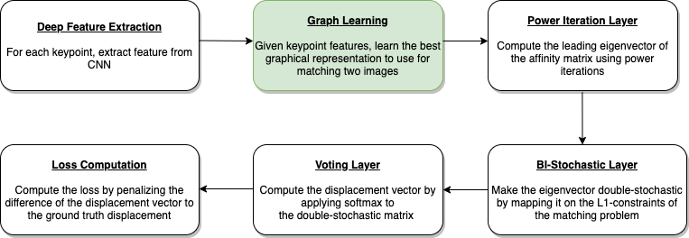
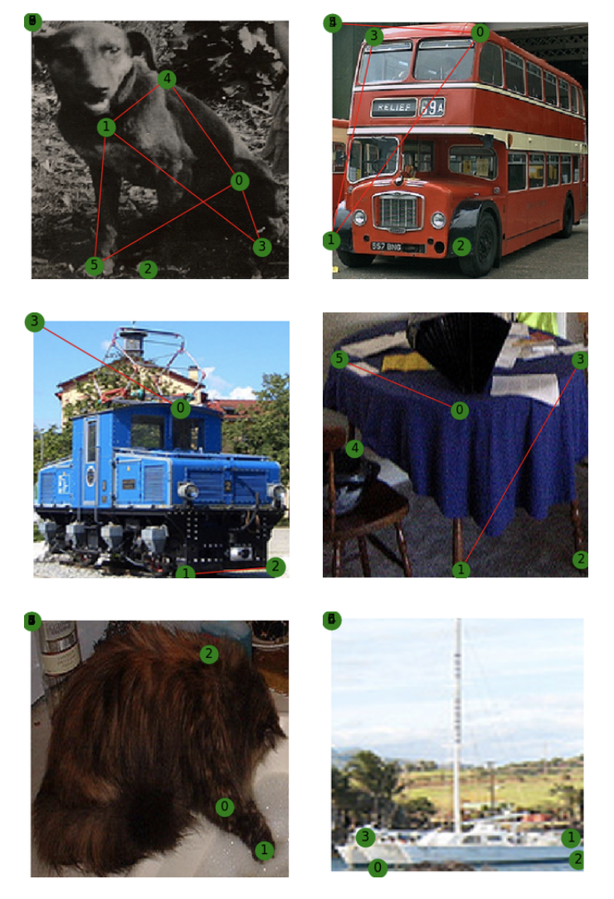

# Graph Learning for Graph Based Semantic Matching

This repository contains PyTorch implementation of the graph semantic matching as a project of the deep learning course at ETH Zuich. The report can be found [here](https://github.com/daniil-777/graph-matching/blob/master/report/DeepLearning_Report.pdf). This code is based off of the implementation of [Github](https://github.com/Thinklab-SJTU/PCA-GM).


## Get started

1. Install all the python packages in requirements.txt by doing ``pip install -r reqiurements.txt``. You could optionally create a virtualenv.
1. Execute ``PATH=$PATH:<Path to root of this folder>``
1. If you want to run experiment on Pascal VOC Keypoint dataset:
    1. Download [VOC2011 dataset](http://host.robots.ox.ac.uk/pascal/VOC/voc2011/index.html) and make sure it looks like ``data/PascalVOC/VOC2011``
    1. Download keypoint annotation for VOC2011 from [Berkeley server](https://www2.eecs.berkeley.edu/Research/Projects/CS/vision/shape/poselets/voc2011_keypoints_Feb2012.tgz) or [google drive](https://drive.google.com/open?id=1D5o8rmnY1-DaDrgAXSygnflX5c-JyUWR) and make sure it looks like ``data/PascalVOC/annotations``
    1. Rename the original annotations folder inside ``data/PascalVOC/VOC2011`` to ``Annotations_original``. So it should finally look like ````data/PascalVOC/VOC2011/Annotations_original/``
    1.  Download the training pairs from [Link](https://github.com/Thinklab-SJTU/PCA-GM/raw/master/data/PascalVOC/voc2011_pairs.npz). Make sure the train/test split is available in ``data/PascalVOC/voc2011_pairs.npz``
1. If you want to run experiment on CUB dataset, please download dataset from [Link](http://www.vision.caltech.edu/visipedia/CUB-200-2011.html) and extract all the contents to ``data/CUB`` folder.
    1. Inside the data folder, execute ``python CUB_processing.py``

## Training

Run training and evaluation

``python train_eval.py --cfg path/to/your/yaml`` 

and replace ``path/to/your/yaml`` by path to your configuration file. Configuration files for the experimets reported in the paper are stored in``experiments/``.

## Config Files

The config files are as follows:
1. PascalVoc experiments:
    1. gl_voc.yaml - With graph Learning 
    1. fc_voc.yaml - With fully connected graphs
    1. delaunay_voc.yaml - With delaunay triangulation on the graph
    1. knn_1_voc.yaml - With knn connectivity with k=1 neighbour.
    1. knn_2_voc.yaml - With knn connectivity with k=2 neighbours.
    1. knn_3_voc.yaml - With knn connectivity with k=3 neighbours.

1. CUB experiments:
    1. gl_cub.yaml - With graph Learning 
    1. fc_cub.yaml - With fully connected graphs
    1. delaunay_cub.yaml - With delaunay triangulation on the graph
    1. knn_1_cub.yaml - With knn connectivity with k=1 neighbour.
    1. knn_2_cub.yaml - With knn connectivity with k=2 neighbours.
    1. knn_3_cub.yaml - With knn connectivity with k=3 neighbours.

## Pipeline
Flow diagram of the different stages of the graphmatching  optimisation:

## Results
Graphs learnt by the network given images andkeypoints  on  Pascal  VOC  dataset



